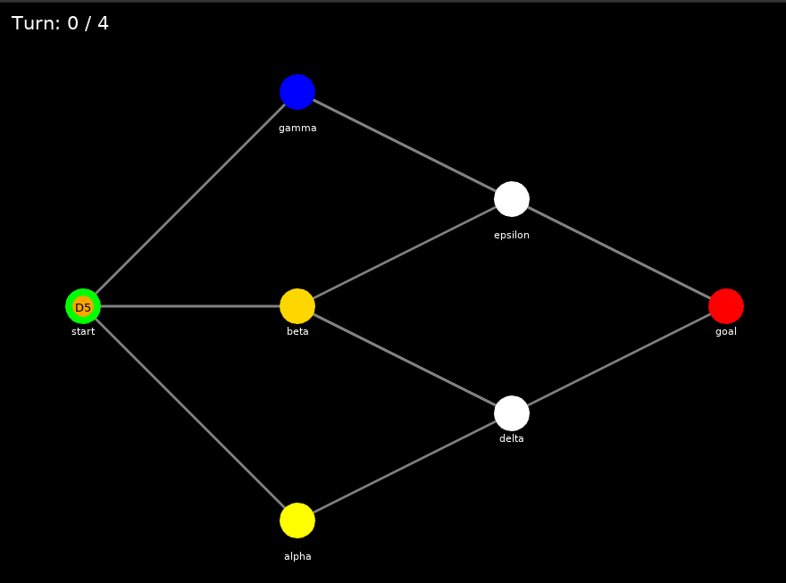
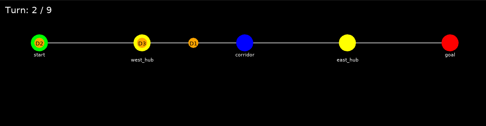
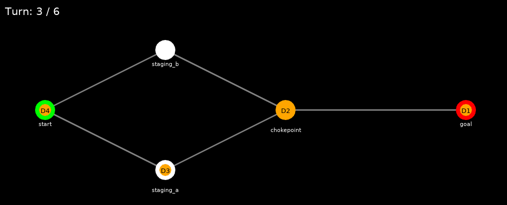

# Fly-in — Space-Time Drone Routing Simulation

> A high-performance, object-oriented Multi-Agent Pathfinding (MAPF) simulation engine and visualizer built from scratch in Python.

---

## Overview

**Fly-in** is a cooperative pathfinding and simulation system designed to route a fleet of drones from a shared start hub to a destination hub across a network of constrained zones—minimizing total simulation turns while guaranteeing **zero collisions**.

Unlike traditional static routing, Fly-in treats **time as a first-class search dimension**. Using a custom **Space-Time Dijkstra** algorithm, the engine searches over `(turn, zone)` states rather than simple spatial graphs, dynamically reserving zones and connections only for the exact turns they are occupied.

### Key Engineering Highlights
* **Space-Time Dijkstra Search:** Elevates standard shortest-path routing into a 3D state space `(cost, turn, zone)` to handle dynamic waiting, multi-turn transits, and bottleneck avoidance.
* **Zero External Graph Dependencies:** Fully custom Graph, Edge, and Node implementations built from scratch (no `networkx`, `graphlib`, or external routing libraries).
* **100% Statically Typed & OOP:** Strictly typed Python 3.10+ codebase passing full `mypy` and `flake8` compliance.
* **Cooperative MAPF Engine:** Uses space-time reservation tables to resolve multi-agent bottlenecks without global state explosion.
* **Hardware-Accelerated Visualization:** Interactive, step-by-step graphical playback built with **Python Arcade**.

---

## Visual Showcase & Algorithm Playback

The simulation includes an interactive GUI built with [Python Arcade](https://api.arcade.academy/) to inspect routing decisions, bottlenecks, and multi-turn transit states.

### 1. Map Topology & Initial Fleet Setup


### 2. Space-Time Transit & Collision Avoidance


### 3. Bottleneck Resolution & Goal Arrival


#### Visualizer Controls
* **`RIGHT Arrow`**: Advance simulation by one turn.
* **`LEFT Arrow`**: Step backward by one turn.
* **`ESC`**: Close the visualizer window.

---

## Core Architecture & Algorithm Strategy

```
+-----------------------------------------------------------------+
|                         MAP PARSER                              |
|   Ingests custom map syntax -> Validates topology & capacities  |
+--------------------------------+--------------------------------+
                                   |
                                   v
+-----------------------------------------------------------------+
|                       CUSTOM GRAPH MODEL                        |
|        Nodes (Zones: Normal, Priority, Restricted, Blocked)     |
|        Edges (Connections with custom max_link_capacity)        |
+--------------------------------+--------------------------------+
                                   |
                                   v
+-----------------------------------------------------------------+
|                       SIMULATION ENGINE                         |
|   Sequential Multi-Agent Routing via Shared Reservation Tables  |
+--------------------------------+--------------------------------+
                                   |
                                   v
+-----------------------------------------------------------------+
|                      SPACE-TIME PATHFINDER                      |
|      Dijkstra / A* Search over (Turn, Zone) State-Space         |
+-----------------------------------------------------------------+
```

### 1. Custom Graph & Strict Parsing (`map_parser.py`, `graph.py`)
The parser reads custom `.txt` map definitions, enforcing validation rules (unique identifiers, positive integer capacities, valid zone metadata, and bidirectional edge mapping). Malformed lines fail fast with descriptive syntax error logging.

### 2. Space-Time Pathfinding (`pathfinder.py`)
Standard Dijkstra's algorithm finds the shortest path in a static 2D graph. Fly-in elevates the search state to `(turn, zone_name)`.
* **State Expansion:** From any current state `(t, u)`, a drone can:
  1. **Move** to an adjacent zone `v` at `t + cost` (where restricted zones cost 2 turns).
  2. **Wait** in place at `(t + 1, u)` if a downstream connection is congested.
* **Dynamic Validation:** A move is only valid if both the target zone capacity (`max_drones`) and the connecting edge capacity (`max_link_capacity`) are free at the exact arrival and transit turns.

### 3. Cooperative Multi-Agent Scheduling (`engine.py`)
To route N agents without exponentially scaling the search space O(V^N), Fly-in uses **Sequential Reservation Tables**:
1. Drones are planned sequentially based on priority.
2. Once a valid route is found, every `(turn, zone)` and `(turn, connection)` traversed is permanently committed to a global reservation table.
3. Subsequent drones pathfind against these committed reservations, turning an NP-Hard multi-agent problem into a fast sequence of single-agent Dijkstra searches.

### 4. Heuristics & Tie-Breaking
When multiple paths yield the same turn arrival cost, ties are broken systematically:
1. **Priority Zones:** Preferred over normal zones per subject specifications.
2. **Load Balancing:** Prefers zones with lower historical occupancy to prevent artificial corridor funnels.
3. **Deterministic Order:** Monotonic insertion ordering guarantees reproducible simulation runs across different OS environments.

---

## Installation & Quick Start

### Prerequisites
* **Python 3.10+**
* [uv](https://github.com/astral-sh/uv) (Recommended) or standard `pip`

### 1. Clone the Repository
```bash
git clone https://github.com/younessrabhi22/fly-in.git
cd fly-in
```

### 2. Run with Makefile (Recommended)
```bash
# Install required dependencies (Arcade, etc.)
make install

# Run simulation on an easy test map
make run MAP=maps/easy/02_simple_fork.txt

# Run static type checking and linter
make lint

# Clean cache directories
make clean
```

### 3. Manual Execution via CLI
If you prefer running directly via Python:
```bash
pip install -r requirements.txt
python3 main.py maps/medium/01_priority_puzzle.txt
```

---

## Map Format Specification

Map files use a human-readable syntax defining fleet size, hub nodes, standard zones, and network connections:

```text
# Easy Level 2: Simple fork with two paths
nb_drones: 4

start_hub: start 0 0 [color=green]
hub: junction 1 0 [color=yellow max_drones=2]
hub: path_a 2 1 [color=blue zone=restricted]
hub: path_b 2 -1 [color=blue]
end_hub: goal 3 0 [color=red]

connection: start-junction [max_link_capacity=2]
connection: junction-path_a
connection: junction-path_b
connection: path_a-goal
connection: path_b-goal
```

---

## Technical Resources & References

**Python Arcade Graphics**
* [Python Arcade Library Official Documentation](https://api.arcade.academy/) — Modern, Pythonic 2D rendering library used for GPU-accelerated graphics, windowing, and custom shape drawing.
* Arcade Drawing Primitives & Shape Lists — Best practices for batch-rendering circles and connecting lines efficiently without immediate-mode OpenGL slowdowns.

**Algorithmic Foundations (Space-Time A* & MAPF)**
* Cooperative Pathfinding (David Silver, 2005) — The foundational AI paper detailing Space-Time A* search and hierarchical reservation tables for multi-agent collision avoidance.
* Red Blob Games: Introduction to A* and Dijkstra's Algorithm — The industry-standard visual guide for graph representation, priority queues, and heuristic pathfinding.
* Multi-Agent Pathfinding (MAPF) Overview — Curated benchmarks, complexity analyses, and modern algorithm classifications for cooperative robotics routing.
